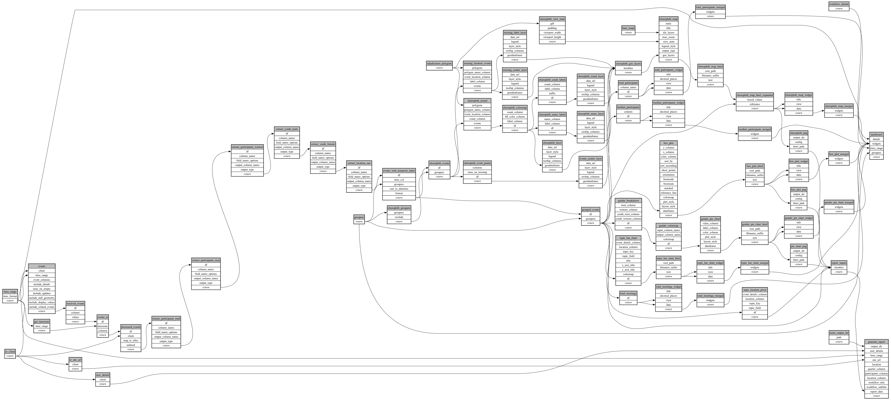

```
# AUTOGENERATED BY ECOSCOPE-WORKFLOWS; see fingerprint in README.md for details

```

```yaml
# fingerprint:
artifacts_sha256_basic: afd0afb656165544b0715b054eb5edd28c7f31bb17514d73518cbb4c6228348c
artifacts_sha256_strict: 410a5561956fe9446693c431835edc3d6acbe6c72c44786de5347cd0f8567425
installed_requirements:
- channel: https://repo.prefix.dev/ecoscope-workflows/
  name: ecoscope-workflows-core
  version: {version: ==0.22.18}
- channel: https://repo.prefix.dev/ecoscope-workflows/
  name: ecoscope-workflows-ext-ecoscope
  version: {version: ==0.22.18}
- channel: https://repo.prefix.dev/ecoscope-workflows-custom/
  name: ecoscope-workflows-ext-custom
  version: {version: ==0.0.57}
- channel: conda-forge
  name: pydeck
  version: {version: ==0.9.2}
- channel: https://repo.prefix.dev/ecoscope-workflows-custom/
  name: ecoscope-workflows-ext-eden
  version: {version: ==0.0.1}
params_sha256: f48af28ac0738c484d6608821cfa8bb546f5804aca630dfe0f692b16a22f3cc5
spec_sha256: 49e5f8157297defc252415b2d70b2142b1d59f2d1cd2d4838dd045dfaa9b32c3

```

# ecoscope-workflows-community-engagement-workflow


