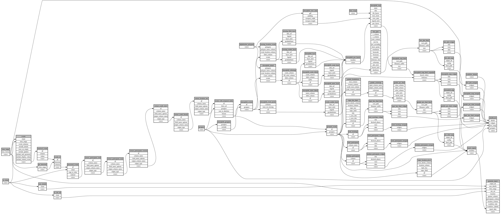

```
# AUTOGENERATED BY ECOSCOPE-WORKFLOWS; see fingerprint in README.md for details

```

```yaml
# fingerprint:
artifacts_sha256_basic: c35dc5be2a6cc00d1773154fcb3d6102feac2cc29a18779e676d155d0509b897
artifacts_sha256_strict: f9b381edd7b4161a612e66b346e93f66b9665bc7de09269c9f4523291de3c280
installed_requirements:
- channel: https://repo.prefix.dev/ecoscope-workflows/
  name: ecoscope-platform
  version: {version: ==2.16.1}
- channel: https://repo.prefix.dev/ecoscope-workflows-custom/
  name: ecoscope-workflows-ext-custom
  version: {version: ==0.1.0rc15}
- channel: conda-forge
  name: pydeck
  version: {version: ==0.9.2}
- channel: https://repo.prefix.dev/ecoscope-workflows-custom/
  name: ecoscope-workflows-ext-eden
  version: {version: ==0.0.2}
params_sha256: bb23fe29d82472dd23be1866f30748267937c883fa527874fd8d6c3e8abf4ac9
spec_sha256: 6dcb66bd10933ffd88d1087e3734a79ddd466e26f5a27e9862c068bae2aeec8f

```

# wt-community-engagement-workflow


